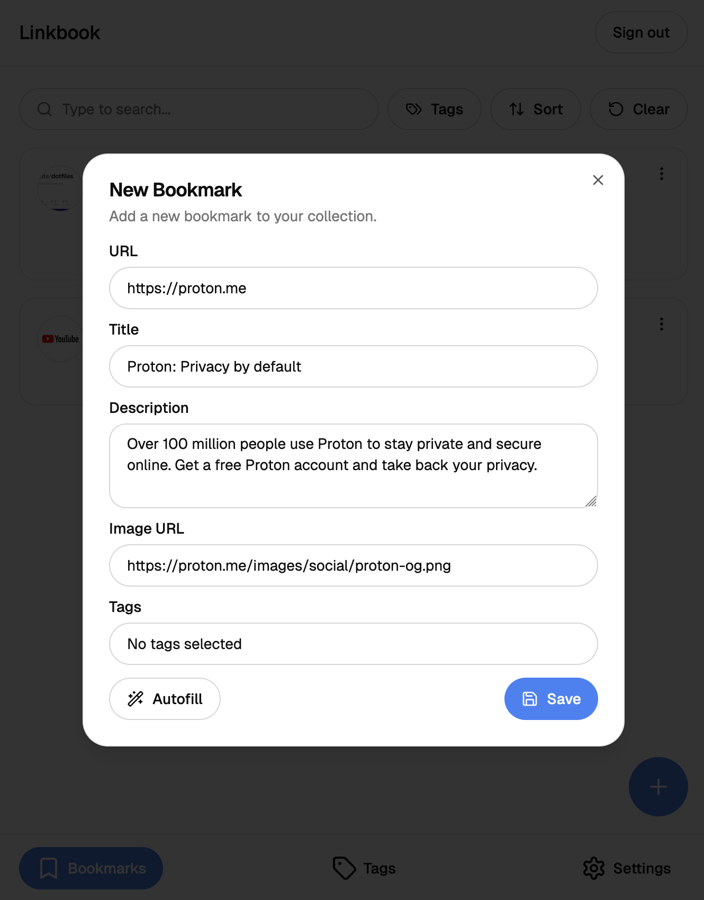
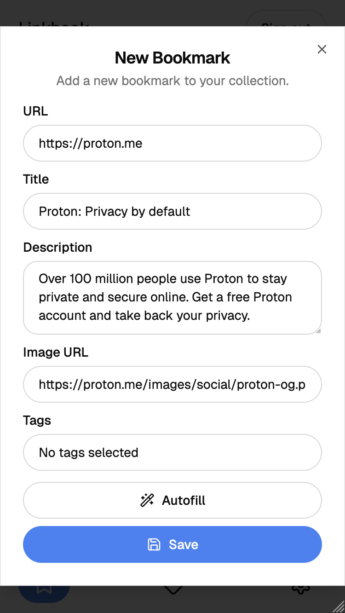

> [!IMPORTANT]  
> This project is still a work-in-progess, some functionality is incomplete and it is currently not hosted anywhere.

# 🔖 Linkbook

_Keep all your important links in a safe place._

_I use the free tier of Supabase so the database is most likely paused._

## Table of Contents

1. [😮 What is it?](#😮-what-is-it?)
2. [🤔 Why make this?](#🤔-why-make-this?)
3. [⚙️ How was it made?](#⚙️-how-was-it-made?)
4. [🖼️ Screenshots](#🖼️-screenshots)
   1. [Home](#home)
   2. [Bookmarks](#bookmarks)
   3. [Tags](#tags)
   4. [Settings](#settings)

## 😮 What is it?

Linkbook is a link bookmarking web app made with [Next.js 15](https://nextjs.org/) and [Supabase](https://supabase.com/).

Users can sign up and add a new bookmark, the link metadata (title, description and image) can be autofilled by pasting the link URL or clicking on the "Autofill" button. The user can also create custom tags and add them to their bookmarks, making the searching, sorting and filtering them easier.

## 🤔 Why make this?

I wanted to create something smaller than my last project and focus on certain code practices, as well as add it to my resume.

## ⚙️ How was it made?

To create this project I used the following technologies:

- [Next.js 15](https://nextjs.org/) for the frontend framework
- [Supabase](https://supabase.com/) for the backend
- [shadcn/ui](https://ui.shadcn.com/) for base UI components
- [TailwindCSS](https://tailwindcss.com/) for CSS
- [Vercel](https://vercel.com/) for the hosting

## 📺 Demo Video

https://github.com/user-attachments/assets/7a229740-ad31-4f36-89be-28b08ec1d7e1

## 🖼️ Screenshots

### Home

| Desktop                                               | Mobile                                              |
| ----------------------------------------------------- | --------------------------------------------------- |
|  |  |

### Bookmarks

| Desktop                                                         | Mobile                                                        |
| --------------------------------------------------------------- | ------------------------------------------------------------- |
|  |  |

### New Bookmark

| Desktop                                                               | Mobile                                                              |
| --------------------------------------------------------------------- | ------------------------------------------------------------------- |
|  |  |

### Tags

| Desktop                                               | Mobile                                              |
| ----------------------------------------------------- | --------------------------------------------------- |
|  |  |

### Settings

| Desktop                                                       | Mobile                                                      |
| ------------------------------------------------------------- | ----------------------------------------------------------- |
|  |  |
